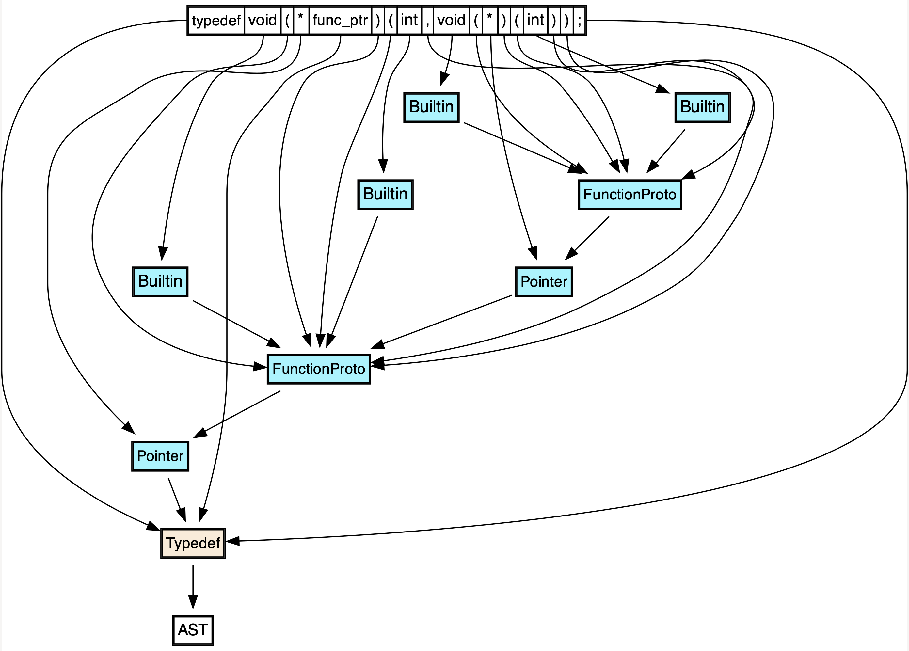

# Print token context graphs

This utility helps to visualize PASTA's `TokenContext` feature, which allows one
to connect tokens (`PrintedToken`) back to AST nodes (e.g. `Decl`, `Stmt`, etc.).
This is a powerful feature, though it's not obvious how to use it absent the
code in this example, hence why this example exists. Without seeing the context
graphs produced by this example, it can also be hard to understand the value of
the context graph printer.

## Usage

**Note:** Prior to using this tool, make sure the `/tmp/tokens` directory exists!

**Note:** If the `PRINTED` environment variable is set (to any value), then the
rendered graphs will be produced as a result of Clang's pretty printing logic,
rather than relfecting the exact tokens that were actually parsed from the file.

```shell
./print-token-graph clang test.c
```

## Output

Each top-level declaration from the original program will be printed to a
separately numbered file and saved into `/tmp/tokens`, e.g. `/tmp/tokens/0.dot`.

The format of each file is a GraphViz DOT digraph. It shows how parsed or
printed tokens relate back to AST nodes.

For example, the token graph for the following C code is as follows:

```c
typedef void (*func_ptr)(int, void (*)(int));
```


